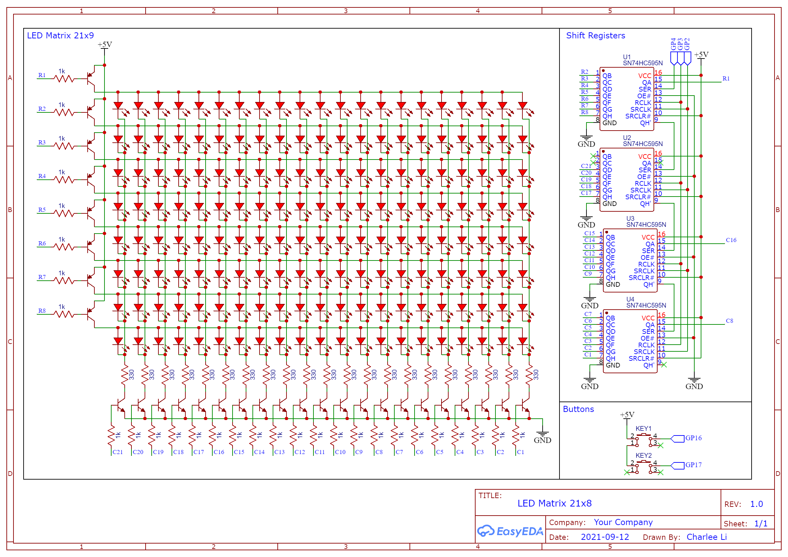

LED Matrix Clock with Raspberry Pi Pico
=========================================

This is my LED matrix project. For details, see the [medium post](https://medium.com/nerd-for-tech/how-i-made-this-real-time-clock-with-raspberry-pi-pico-700ed5b531cd).

## How to Run the Code

Load your RPi Pico with [Micropython](https://www.raspberrypi.org/documentation/microcontrollers/micropython.html#drag-and-drop-micropython).

Copy all the files under `src` to the root of your RPi Pico. This can be done with [rshell](https://github.com/dhylands/rshell),
or with the File Open dialgo of the [Thonny Python IDE](https://thonny.org/).

Open the `clock.py` in Thonny and run it. If you want it to run automatically on boot, rename it to `main.py`.

When running with a computer, the clock should be automatically adjusted to the correct time.
Without a computer, the two buttons can be used to adjust the time.

## Schematic

